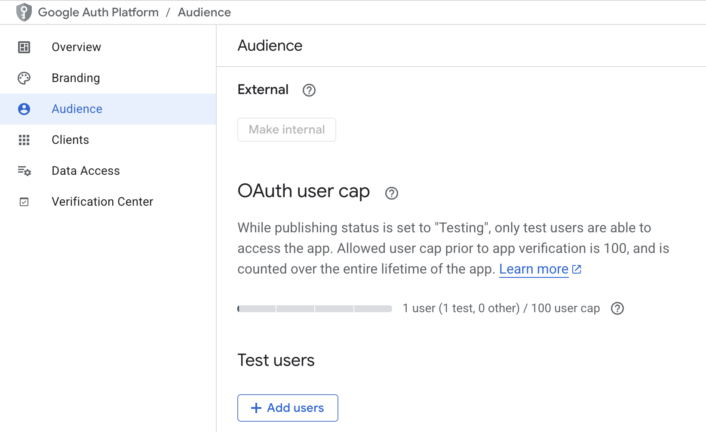
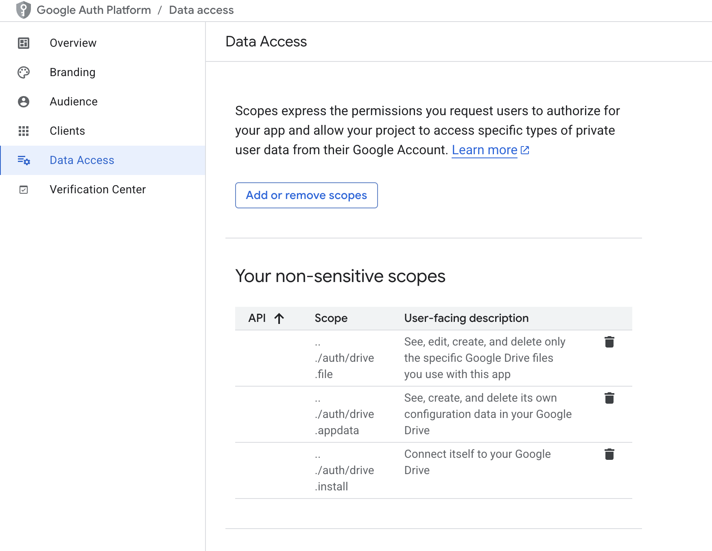

# Hướng dẫn gen QR và gửi lên Google Excel

## 1. Setup GCP
* Truy cập [Google Cloud Console](https://console.cloud.google.com/)

* Tạo project mới

* Enable service **Google Drive API** và **Google Sheet API**

* Tạo OAuth credentials : https://developers.google.com/workspace/sheets/api/quickstart/python

* Thêm test users và kiểm tra scope (cần thêm scope cho GG drive và GG sheet)

    * Test user
        
    * Scope
        

* Lưu file credentials vừa tạo vào repo folder và đặt tên "credentials.json"
    ```
        {
            "installed": {
                "client_id": "your-client-id",
                "project_id": "your-project-id",
                "auth_uri": "https://accounts.google.com/o/oauth2/auth",
                "token_uri": "https://oauth2.googleapis.com/token",
                "auth_provider_x509_cert_url": "https://www.googleapis.com/oauth2/v1/certs",
                "client_secret": "your-client-secret",
                "redirect_uris": [
                    "http://localhost"
                ]
            }
        }
    ```

## 2. Setup Google Sheet

* Tạo GG sheet bằng tài khoản GG dùng để truy cập GCP
* Share quyền cho GG project (optional)

## 3. Chạy file

```
pip install -r requirements.txt
python main.py
```


